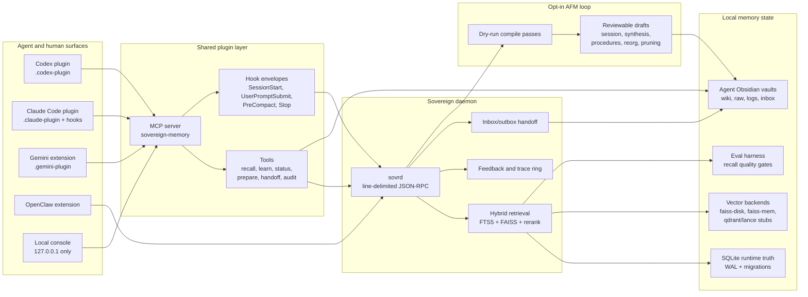

# Sovereign Memory

Sovereign Memory is a local-first memory spine for AI agents. It gives Codex,
Claude Code, Gemini, OpenClaw, Hermes, and future agents a shared recall daemon,
agent-owned Obsidian vaults, manual vault-first learning, auditable handoffs, and
an opt-in AFM self-organization loop.

It is built for agents first and humans second: the durable source of truth stays
local and inspectable, while the agent surfaces get fast recall, compact context
packs, and continuity across sessions.

## Architecture



## What v4 Adds

- **Storage abstraction**: SQLite remains runtime truth while vector backends can
  fan out through disk FAISS, memory FAISS, and future Qdrant/Lance adapters.
- **Eval harness**: recall quality gates, query fixtures, comparison reports,
  and policy contracts live beside the engine.
- **Retrieval upgrades**: cache layers, query expansion, HyDE cold-query second
  pass, MMR token packing, progressive disclosure, and source authority metadata.
- **Memory governance**: structured learnings, contradiction detection,
  supersession, feedback demotion, trace IDs, health reports, and hygiene checks.
- **Agent continuity**: Claude Code hooks, Codex and Gemini plugin manifests,
  handoff inbox/outbox packets, scar-tissue capture before compaction, and
  deterministic `<sovereign:context>` envelopes.
- **AFM self-organization**: opt-in dry-run compile passes for session
  distillation, synthesis, procedure extraction, vault reorganization, and
  pruning. Drafts are written for review, not silently accepted.

## Core Runtime

The Python engine lives in `engine/`.

- `sovrd.py` exposes the local JSON-RPC daemon.
- `sovereign_memory.py` exposes CLI commands for indexing, stats, hygiene,
  vector status, and AFM compile dry-runs.
- `db.py` owns schema creation and migrations. Migrations are additive and
  tracked by name plus `PRAGMA user_version`.
- `retrieval.py` combines FTS5, semantic vectors, reranking, feedback, query
  expansion, HyDE, token budgets, and trace capture.
- `afm_passes/` contains the self-organization passes. They default to dry-run
  and degrade cleanly when AFM is unavailable.

SQLite is the durable runtime truth. Vault pages, graph exports, FAISS files,
and plugin context packs are derived or review surfaces.

## Plugin Surfaces

The shared plugin lives in `plugins/sovereign-memory/` and ships multiple
agent-facing manifests from one TypeScript MCP server:

- `.codex-plugin/` for Codex.
- `.claude-plugin/` plus `hooks/hooks.json` for Claude Code.
- `.gemini-plugin/` for Gemini extension usage.
- `.mcp.json` for direct MCP registration.

The plugin exposes:

- `sovereign_status`
- `sovereign_recall`
- `sovereign_prepare_task`
- `sovereign_prepare_outcome`
- `sovereign_route`
- `sovereign_learning_quality`
- `sovereign_learn`
- `sovereign_vault_write`
- `sovereign_audit_report`
- `sovereign_audit_tail`
- `sovereign_compile_vault`
- `sovereign_negotiate_handoff`

Automatic behavior is recall-only. Durable learning, vault writes, and AFM draft
acceptance remain explicit human or agent decisions.

## Quickstart

Install Python dependencies for the engine:

```bash
cd engine
python3 -m pip install -r requirements.txt
```

Run the daemon:

```bash
cd engine
python3 sovrd.py --socket /tmp/sovrd.sock
```

Inspect health and recall from another terminal:

```bash
cd engine
python3 sovrd_client.py --socket /tmp/sovrd.sock status
python3 sovrd_client.py --socket /tmp/sovrd.sock search "memory handoff"
```

Run AFM compile passes as review-only dry-runs:

```bash
cd engine
SOVEREIGN_AFM_LOOP=on python3 -m sovereign_memory compile --pass session_distillation --dry-run
SOVEREIGN_AFM_LOOP=on python3 -m sovereign_memory compile --pass synthesis --dry-run
```

Build and test the plugin:

```bash
cd plugins/sovereign-memory
npm install
npm test
npm run smoke:hook
```

Start the local console:

```bash
cd plugins/sovereign-memory
npm run console
```

The console binds locally and exposes status, audit, prepare-task, and
prepare-outcome endpoints. It does not expose automatic learning.

## Vault Model

Each agent can have its own Obsidian vault while sharing the same daemon and
database. The vault is the readable memory surface:

```text
vault/
  index.md
  log.md
  logs/
  raw/
  wiki/
  wiki/handoffs/
  inbox/
  outbox/
  schema/
```

Use short, sourced wiki pages with frontmatter for durable knowledge. Raw session
material and private logs should stay local and out of public git unless they are
explicitly sanitized.

## Verification Gate

Before pushing a release candidate, run:

```bash
cd engine && pytest -q
cd ../plugins/sovereign-memory && npm test
npm run smoke:hook
```

Also run a temp-state live smoke:

- Start `engine/sovrd.py` on a temporary Unix socket.
- Call plugin helpers for status, recall, compile dry-run, and handoff.
- Verify redaction, traceability, and clean SIGTERM shutdown.
- Run migration safety on a SQLite backup, never directly on the live DB.

The v4 acceptance baseline is `213 passed, 3 skipped` for engine tests and
`32 passed` for plugin tests.

## Repository Map

- `engine/` - Python daemon, retrieval, migrations, AFM passes, eval harness.
- `plugins/sovereign-memory/` - shared MCP plugin for Codex, Claude Code, and
  Gemini.
- `openclaw-extension/` - OpenClaw bridge and import tooling.
- `docs/contracts/` - policy, threat model, page types, capabilities, and
  workflow contracts.
- `docs/plans/execution/` - v3.1 to v4 rollout PR specs and resume ledger.
- `eval/` - recall fixtures and generated evaluation reports.

For local path layout and symlink compatibility notes, see
`docs/CANONICAL-PATHS.md`.
